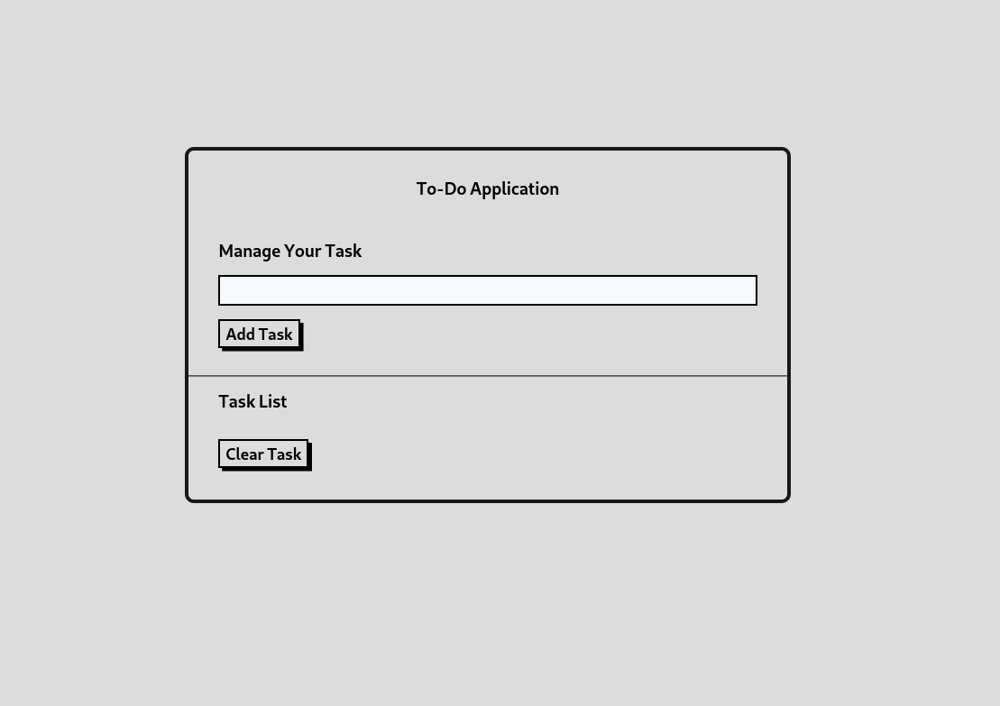
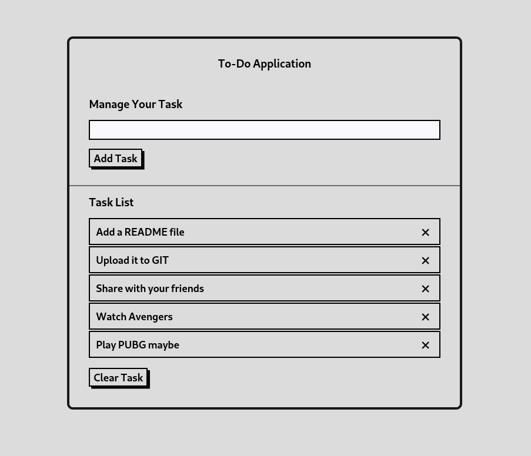

# TODO-Application
This is a simple ToDo Application inspired from a course by Brad Traversy.
Link - https://www.udemy.com/course/modern-javascript-from-the-beginning/

The tasks are stored in the local storage of the browser so the tasks don't get wiped out even after the refresh.

## UI of the Application

## Adding Tasks

 
## Features of the ToDo
- Add Tasks
- Remove Individual Task
- Remove All Tasks
- Persistent to Local Storage
- Responsive to Mobile Devices

## Demo - https://prabesh-np.github.io/TODO-Application/
